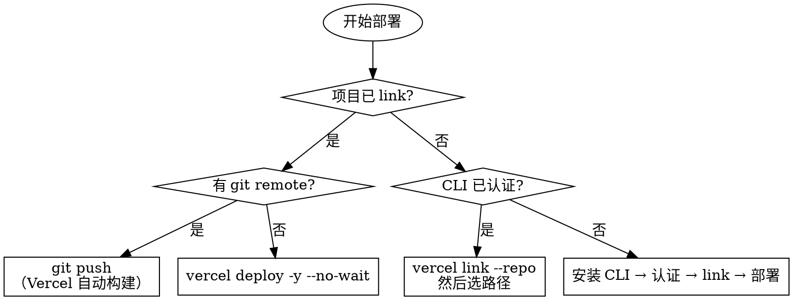

# 外部 CLI 集成型 Skill

> 一句话定义：把某个 CLI 工具的安装、认证、核心命令和错误恢复封装成 LLM 可直接执行的指南，LLM 无需猜测参数、无需手动查 man page。

## 本质

LLM 不知道 CLI 工具是否已安装、是否已认证、哪个子命令适合当前场景。CLI 型 skill 的本质是**消除 LLM 面前的不确定性**：

1. **前置条件检查**（Prerequisites）：工具是否可用？认证是否就绪？
2. **决策树**：根据当前环境状态选择正确的执行路径
3. **命令参考**：精选的、场景分类的核心命令
4. **错误处理**：常见失败模式及对应诊断/修复命令

没有这四个部分，LLM 会频繁猜错状态、用错命令、遇到认证问题后不知所措。

## 什么时候用

- 封装一个有 CLI 工具的服务（GitHub、Vercel、AWS、Fly.io、npm...）
- LLM 需要根据环境状态（已安装/未安装、已认证/未认证、已链接/未链接）走不同执行路径
- CLI 子命令多、容易选错，需要按场景归类
- 工具有非显而易见的认证流程（token、OAuth、scope）

## 什么时候不用

- CLI 只有 2-3 个命令，直接写进纯文本 skill 即可
- 工具是标准 Unix 工具（git、curl、grep），LLM 本身已熟悉，不需要 skill
- 实际需要的是"派发 subagent 执行复杂多步任务"→ 用 Agent Dispatch 型

## 必须包含的结构

### 1. Prerequisites 节

LLM 在执行任何命令前必须先确认工具可用、认证有效。Prerequisites 节的格式：

```markdown
## Prerequisites

### Installation
\`\`\`bash
# 主平台安装命令
brew install <tool>

# 次平台
apt install <tool>

# 验证安装
<tool> --version
\`\`\`

### Authentication
\`\`\`bash
# 登录命令
<tool> auth login

# 验证认证状态（每次执行前先跑这条）
<tool> auth status

# 吊销/重新认证
<tool> auth logout
\`\`\`

### Pre-flight Check
\`\`\`bash
# 一条命令确认工具可用且已认证
<tool> whoami 2>/dev/null || echo "not authenticated"
\`\`\`
```

**关键原则**：
- 安装命令必须包含验证命令（`--version` 或 `whoami`），让 LLM 能确认安装成功
- 认证步骤必须包含"检查状态"命令，区分"未安装"和"未认证"两种失败
- Prerequisites 节放在 SKILL.md 最前面，LLM 第一眼就能看到

### 2. 决策树

根据环境状态选择执行路径。推荐用 Graphviz DOT 格式，LLM 能直接理解分支逻辑：



也可以用 Markdown 标题层级表达决策树（deploy-to-vercel 的做法），适合路径描述比图形更清晰的场景：

```markdown
### 路径 A：已 link + 有 git remote → Git Push（推荐）
### 路径 B：已 link + 无 git remote → vercel deploy
### 路径 C：未 link + CLI 已认证 → Link 后部署
### 路径 D：未 link + CLI 未认证 → 从安装开始
```

### 3. 核心命令（按场景分组）

不要列出所有命令的流水账。按用户任务分组，每组 3-8 条最常用命令：

```markdown
## 常用操作

### Issues
\`\`\`bash
gh issue list                          # 列出 open issues
gh issue create --title "..." --body "..."
gh issue close 42
gh issue view 42
\`\`\`

### Pull Requests
\`\`\`bash
gh pr list
gh pr create --fill                    # 用 commit 信息自动填充
gh pr merge 42 --squash
gh pr view 42 --web                    # 在浏览器打开
\`\`\`
```

### 4. 错误诊断命令

每个 CLI skill 必须包含"出错了怎么办"的诊断命令：

```markdown
## Troubleshooting

### 认证失败
\`\`\`bash
<tool> auth status          # 检查认证状态
<tool> auth refresh         # 刷新 token
<tool> auth login           # 重新登录
\`\`\`

### 工具未找到
\`\`\`bash
which <tool>                # 确认安装路径
<tool> --version            # 确认版本
\`\`\`
```

## SKILL.md 模板

```markdown
---
name: <tool-name>
description: <触发词 + 工具用途一句话>. Use when: <触发场景列表>.
---

# <Tool Name>

<工具一句话介绍 + 最重要的默认行为约定>

## Prerequisites

### Installation
\`\`\`bash
# macOS
brew install <tool>

# Linux
<linux-install-command>

# 验证安装
<tool> --version
\`\`\`

### Authentication
\`\`\`bash
# 登录
<tool> auth login

# 检查认证状态（每次执行前确认）
<tool> auth status
\`\`\`

## Step 1: 收集环境状态

在选择执行路径之前，先运行这些检查命令：

\`\`\`bash
# 检查 1: <状态描述>
<check-command-1> 2>/dev/null

# 检查 2: <状态描述>
<check-command-2> 2>/dev/null
\`\`\`

## Step 2: 选择执行路径

### 路径 A: <条件描述> → <方法名>

<操作步骤>

\`\`\`bash
<commands>
\`\`\`

---

### 路径 B: <条件描述> → <方法名>

<操作步骤>

---

### 路径 C: <兜底路径>

\`\`\`bash
# 安装
<install>

# 认证
<auth>

# 然后执行
<main-command>
\`\`\`

## 常用命令

### <场景 1>
\`\`\`bash
<command-1>    # <说明>
<command-2>    # <说明>
\`\`\`

### <场景 2>
\`\`\`bash
<command-3>    # <说明>
\`\`\`

## Troubleshooting

### <常见错误 1>
\`\`\`bash
<诊断命令>
<修复命令>
\`\`\`

### <常见错误 2>
\`\`\`bash
<诊断命令>
\`\`\`
```

## 案例对比

### gh-cli：全量参考型

**特征**：
- Prerequisites 节完整（安装 × 4 平台 + 认证 × 6 命令 + git 集成）
- CLI 结构用树形图呈现全貌（无需 LLM 猜子命令存不存在）
- 命令按功能域分组：Issues / PRs / Actions / Releases / Gists...
- 每组命令有行内注释说明用途
- 不含决策树（因为 `gh` 没有"环境状态"依赖，任何时候命令都一样）

**适用场景**：工具的使用方式不依赖环境状态，LLM 需要的是"哪个命令做什么"的全量参考，而非"我现在该走哪条路"的决策指导。

**风格关键词**：完整、分类、查阅式

---

### deploy-to-vercel：决策驱动型

**特征**：
- Step 1 强制先做 4 项状态检查（linked? git remote? auth? team?）
- Step 2 按状态组合给出 4 条执行路径（Markdown 标题层级 = 决策树）
- 每条路径是自包含的操作序列，不需要 LLM 自己拼凑
- 包含"不要做什么"的负面约束（`Do NOT use vercel project inspect` / 永远 preview 除非明确要求 production）
- 兜底路径（No-Auth Fallback）处理认证不可用的沙箱环境

**适用场景**：工具的正确用法严重依赖环境状态，LLM 选错路径会导致副作用（意外 push、意外 link、意外 production 部署）。

**风格关键词**：决策驱动、状态感知、防误操作

---

### 什么时候用哪种风格？

| 判断维度 | 全量参考型（gh-cli 风格） | 决策驱动型（deploy-to-vercel 风格） |
|---------|------------------------|----------------------------------|
| 环境状态是否影响命令选择 | 否（命令基本稳定） | 是（不同状态走不同路径） |
| 误操作代价 | 低（命令可重跑） | 高（push、deploy、link 有副作用） |
| 子命令数量 | 多（需要全量索引） | 少（只有几个核心操作） |
| LLM 需要什么 | "哪个命令做什么" | "现在应该走哪条路" |

**实践建议**：两种风格可以结合。决策驱动型处理"该做什么"，全量参考型处理"怎么做细节"。deploy-to-vercel 也可以加一个 Appendix 列出所有可用的 `vercel` 子命令作为参考。

## 常见踩坑

### 1. 没有 Prerequisites 节

**问题**：LLM 直接执行命令，但工具未安装 → 报 `command not found` → LLM 不知道该装什么版本、用什么包管理器。

**后果**：LLM 开始猜测，可能安装错误的工具或版本。

**修复**：Prerequisites 节必须包含：主流平台的安装命令 + 验证安装的命令 + 检查认证的命令。

---

### 2. 命令列表太长，缺乏场景分类

**问题**：SKILL.md 里堆了 50 条命令，没有分组，LLM 需要从头扫描选择。

**后果**：注意力被稀释，LLM 选错命令概率上升，尤其是名字相似的子命令（`vercel ls` vs `vercel inspect`）。

**修复**：按用户任务分组（不超过 8 条/组），每组加行内注释。如果命令太多，考虑多文档导航型 skill，把子命令分散到子文档。

---

### 3. 没有错误诊断命令

**问题**：命令失败后，SKILL.md 没有提供诊断入口，LLM 只能重试原命令或向用户报告失败。

**后果**：简单的认证过期问题变成无法解决的障碍。

**修复**：Troubleshooting 节必须覆盖最常见的 3-5 种失败模式，每种都有对应的诊断命令和修复步骤。

---

### 4. 环境检查命令有副作用

**问题**：用"检查"命令来感知状态，但该命令本身会改变状态（例如 `vercel link` 在未 link 目录会静默创建链接）。

**后果**：Step 1 的检查操作意外触发了副作用，用户不知情。

**修复**：状态检查只能用幂等命令（`2>/dev/null` 忽略错误、`--format json` 只读输出）。deploy-to-vercel 专门标注了哪些命令"safe to run anywhere"。

---

### 5. 没有"默认行为约定"

**问题**：SKILL.md 没有说明默认规则（例如"默认部署到 preview 而非 production"），LLM 自己决策，可能导致意外的生产部署。

**修复**：在 SKILL.md 开头明确写出关键的默认约定和"除非用户明确要求否则不做 X"的约束。

## 来源

- `~/.claude/skills/gh-cli/SKILL.md` — 全量参考型的典型实现，Version 2.85.0
- `~/.claude/skills/deploy-to-vercel/SKILL.md` — 决策驱动型的典型实现，v3.0.0
- `cookbook/skills/patterns/_index.md` — 5 种 skill 类型分类框架
