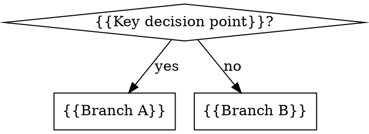

# 纯文本型 Skill

> 一句话定义：全部内容放在单一 SKILL.md 文件里，不需要子文档、脚本或工具文件。

## 本质

纯文本型 skill 是最轻量的 skill 形态。所有内容——触发条件、核心流程、决策逻辑、常见陷阱——都在一个文件里写完。LLM 读完这一个文件就能独立执行。

没有目录导航，没有"详情见 X.md"，没有依赖外部文件。单文件即完整交付。

适用于"内容总量能在 500 词以内说清楚，且不需要可复用脚本或超大参考表"的场景。

## 什么时候用

- **流程型知识** — 告诉 LLM"如何一步步做某件事"。例：brainstorming（探索需求 → 提方案 → 确认设计），dispatching-parallel-agents（分域 → 派发 → 整合）。流程清晰、步骤有限，不需要额外文件。
- **决策规则** — 告诉 LLM"在什么条件下走哪条路"。包含少量分支判断时，一个决策图表 + 几行文字就够了。
- **原则/禁令型** — 强制要求 LLM 遵守某个约束，例如"设计没经过审批禁止动代码"。这类内容越短越有力，单文件是天然选择。
- **内容总量 < 500 词** — writing-skills 的官方建议：频繁加载的 skill 控制在 200 词以内，其他 skill < 500 词。能装进去就别拆。

## 什么时候不用

- **参考资料超大** — API 文档、语法手册、100+ 行代码示例。超过 100 行的参考内容应单独成文件，否则每次加载都吃大量 context。
- **包含可复用脚本/工具** — 如果 skill 附带一个可直接执行的脚本（比如 render-graphs.js），脚本应该单独存放，而不是内嵌在 SKILL.md 里。
- **多个独立子主题需要分别深入** — 当一个 skill 覆盖多个彼此独立的深度主题时，强行塞进单文件会让 LLM 难以导航，应改用 multi-doc-navigation 模式。
- **内容会频繁局部更新** — 单文件对大规模重组不友好，如果某段内容预计频繁变更且独立，拆文件更易维护。

## 目录结构

```
skill-name/
└── SKILL.md          ← 全部内容在这里
```

## SKILL.md 模板

```markdown
---
name: {{skill-name-with-hyphens}}
description: Use when {{specific triggering conditions and symptoms, no workflow summary}}
---

# {{Skill Human Name}}

## Overview

{{Core principle in 1-2 sentences. What does this skill help with?}}

<HARD-GATE>
{{Optional: If there's a rule that must never be violated, put it in a HARD-GATE block.
Example: Do NOT proceed to implementation until design is approved.}}
</HARD-GATE>

## When to Use



**Use when:**
- {{Symptom or scenario 1}}
- {{Symptom or scenario 2}}

**Don't use when:**
- {{Counter-scenario 1}}
- {{Counter-scenario 2}}

## The Pattern

### 1. {{Step One Title}}

{{Step description. Be concrete. What exactly should the LLM do?}}

### 2. {{Step Two Title}}

{{Step description.}}

### 3. {{Step Three Title}}

{{Step description.}}

## {{Quick Reference or Key Principles}}

- **{{Principle 1}}** — {{brief explanation}}
- **{{Principle 2}}** — {{brief explanation}}
- **{{Principle 3}}** — {{brief explanation}}

## Common Mistakes

**❌ {{Bad pattern}}:** {{what goes wrong}}
**✅ {{Good pattern}}:** {{what to do instead}}

**❌ {{Bad pattern 2}}:** {{what goes wrong}}
**✅ {{Good pattern 2}}:** {{what to do instead}}
```

说明：
- `{{skill-name-with-hyphens}}`：只用字母、数字、连字符，不含括号或特殊字符
- `description` 字段：只写触发条件，**禁止**写流程摘要（否则 LLM 会跳过 skill 主体直接按描述行事）
- Graphviz dot 图只用于"LLM 可能判断错的决策点"，线性步骤用编号列表
- HARD-GATE 块用于必须强制遵守的约束，非强制规则不要用

## 变体

纯文本 skill 内部有三种常见风格，混合使用也可以：

### 知识型（reference）

内容是"你需要知道什么"。以表格、条目列表为主，让 LLM 快速检索某个值或规则。代表：rust-production-style（编码约定速查表）。

特征：Quick Reference 表占主体；内容密度高，篇幅往往接近上限 500 词。

### 流程型（process）

内容是"你需要按什么顺序做"。以编号步骤 + Graphviz 流程图为主，重点是让 LLM 不跳步、不提前终止。代表：brainstorming（6 步流程，HARD-GATE 防止跳过设计直接写代码）。

特征：有显式步骤编号；流程图描述循环/回退逻辑；HARD-GATE 用于强制检查点。

### 规则型（rules）

内容是"你必须/不能做什么"。格式上强调对比（❌ vs ✅），反模式和合规示例并列呈现，让 LLM 在压力场景下也能识别并拒绝违规行为。代表：dispatching-parallel-agents（并行条件判断，明确列出"何时不用"和常见错误）。

特征：大量 ❌/✅ 对比；"Common Mistakes"章节权重高；反模式描述越具体越好。

## 真实案例分析

### brainstorming：HARD-GATE 的价值

brainstorming 是典型的流程型 skill。它用一个 `<HARD-GATE>` 块强制"设计审批前禁止实现"，比普通 bullet 更有约束力。

关键设计决策：
1. **Anti-Pattern 章节紧跟 HARD-GATE** — "This Is Too Simple To Need A Design" 直接对抗最常见的合理化借口，在 LLM 产生"这个项目太简单了不需要走流程"的念头之前就把它堵死。
2. **流程图的终止态是 doublecircle** — `"Invoke writing-plans skill" [shape=doublecircle]` 明确标记终止节点，LLM 看到这里就知道该停手了，不会继续往下发散。
3. **"terminal state"的文字声明** — 流程图之后紧接一句 "The terminal state is invoking writing-plans"，双重确认，防止 LLM 误解图的含义。

### dispatching-parallel-agents：为什么用 Graphviz 而不是列表

dispatching-parallel-agents 的 "When to Use" 章节用了一个 dot 图，而不是纯文字列表。这不是风格偏好，是设计选择：

**问题**：并行派发的前提条件有多层嵌套判断——"多个失败 → 是否独立 → 是否能并行"。如果写成文字列表：
```
- 多个失败
  - 如果独立
    - 如果无共享状态 → 并行
    - 如果有共享状态 → 顺序
  - 如果相关 → 单 agent
```
LLM 容易把"多个失败"这个前提条件误读为充分条件，直接跳到并行。

**解决方案**：dot 图把每一步都变成显式的菱形决策节点，迫使 LLM 逐条求值。图的语义是"先判断 → 再决定"，列表的语义是"满足条件 → 执行"，两者在分支逻辑上行为不同。

**写作-skills 的官方原则**：flowchart 只用于 "decision where I might go wrong"，线性信息用列表。dispatching-parallel-agents 的图符合这个原则——它覆盖的恰恰是那个 LLM 最容易判断错的多层分支。

## 常见踩坑

**description 写成了流程摘要** — 最高频错误。例如写 `description: Use when you need to dispatch parallel agents - group failures, create tasks, run concurrently`。后果：LLM 读完 description 就以为懂了，跳过 SKILL.md 主体，错过"何时不用"和 Common Mistakes 等关键内容。修复：description 只写触发条件，不写流程。

**单文件塞了过多内容** — 超过 500 词、包含大段代码、嵌入 API 参考表。后果：每次加载都消耗大量 context，LLM 读到后半段注意力已分散。修复：超 100 行的参考内容拆到子文件，改用 multi-doc-navigation 模式。

**决策逻辑用列表写** — 多层 if/else 分支用缩进列表呈现，LLM 容易短路跳到结论。修复：三层以上的决策分支改用 dot 图。

**HARD-GATE 滥用** — 把"建议"而非"强制约束"放进 HARD-GATE 块，导致 LLM 把它当作不可逾越的门，在某些合理场景下产生不必要的阻塞。修复：HARD-GATE 只用于"永远不能绕过的前置条件"。

## 来源

- raw: `/Users/neo/.claude/plugins/cache/superpowers-marketplace/superpowers/4.3.1/skills/brainstorming/SKILL.md`
- raw: `/Users/neo/.claude/plugins/cache/superpowers-marketplace/superpowers/4.3.1/skills/dispatching-parallel-agents/SKILL.md`
- raw: `/Users/neo/.claude/plugins/cache/superpowers-marketplace/superpowers/4.3.1/skills/writing-skills/SKILL.md`
- 相关模式: [[multi-doc-navigation]]
